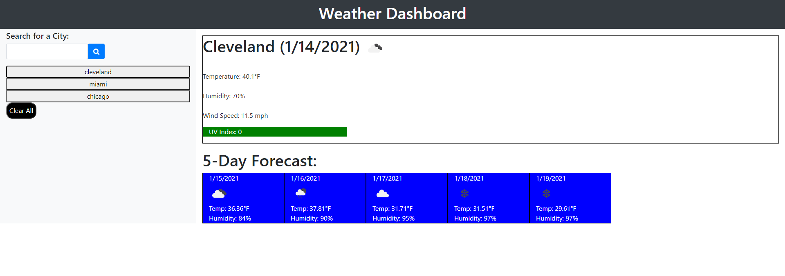

#Homework

#Weather-Dashboard

## Description 

This project is a CWRU Coding Bootcamp homework assignment. This goal of this assignment is to create a weather dashboard with current weather conditions and a five-day forecast for whatever city a user inputs. Basic HTML was provided and the student was to write the JavaScript. 

The purpose of this homework assignment is to practice retrieving data from another application's API and integrating this information in our own application. 

The user story of this assignment was:  
AS A traveler 
I WANT to see the weather outlook for multiple cities 
SO THAT I can plan a trip accordingly  

The acceptance criteria given in the assignment is as follows: 

GIVEN a weather dashboard with form inputs  
WHEN I search for a city 
THEN I am presented with current and future conditions for that city and that city is added to the search history  
WHEN I view current weather conditions for that city 
THEN I am presented with the city name, the date, an icon representation of weather conditions, the temperature, the humidity, the wind speed, and the UV index  
WHEN I view the UV index 
THEN I am presented with a color that indicates whether the conditions are favorable, moderate, or severe  
WHEN I view future weather conditions for that city 
THEN I am presented with a 5-day forecast that displays the date, an icon representation of weather conditions, the temperature, and the humidity  
WHEN I click on a city in the search history 
THEN I am again presented with current and future conditions for that city  
WHEN I open the weather dashboard 
THEN I am presented with the last searched city forecast 

 

Deployed application link: (https://diane-furlong.github.io/Weather-Dashboard/)

Screenshot of deployed application: 
  

## Table of Contents

* [Installation](#installation)
* [Usage](#usage)
* [Credits](#credits)
* [Contributing](#contributing)
* [Tests](#tests)

## Installation

No installation is needed for this project.

## Usage 

Download the code and open to view using your favorite browser, or click the link above to view the deployed site.

## Credits

Assignment (including some code) provided by CWRU Coding Bootcamp.

## Contributing

Contributions in the form of suggestions or feedback are appreciated.

## Tests

There are no tests for this project.

---
